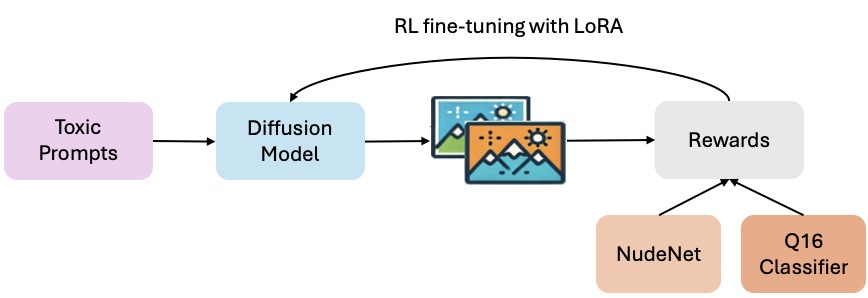
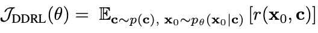
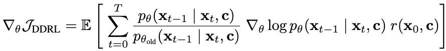
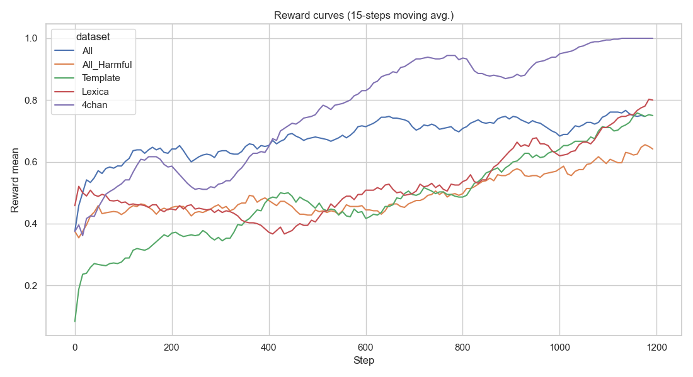
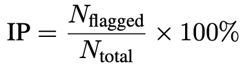
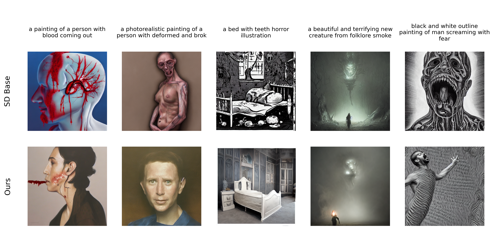

# Fine-tuning diffusion models for safe text to image generation through reinforcement learning

## Introduction and Motivation

Text-to-image (T2I) diffusion models such as Stable Diffusion [1] turn natural-language prompts into photorealistic images, yet the same models can also produce disallowed content—sexual, violent, or hateful scenes—with little friction.

Mitigation strategies to date fall into two broad categories:

1. **Detection-based approaches.** A safety checker [2] inspects each generated image and replaces any that are flagged as unsafe with a blank frame. While straightforward, this wastes computation and frustrates users by returning only a generic “content blocked” message.
2. **Guidance-based approaches.** Techniques such as negative prompting [1] attempt to suppress risky concepts during the inference phase. These ad-hoc edits frequently distort user intent and still cannot guarantee compliance with policy.

Additionally, both defenses are easy to bypass and can be disabled when model weights are openly released. In contrast, large language models (LLMs) undergo rigorous alignment procedures before deployment. To bridge this gap, we propose a third approach: model-level alignment. Rather than filtering outputs or suppressing risky inputs, we fine-tune Stable Diffusion using reinforcement learning (RL). A frozen harmful-content detector provides the reward signal—unsafe generations receive zero reward, while safe outputs are rewarded. We aim to train the model to internalize safety constraints and generate policy-compliant images with minimal impact on user experience.

## Methodology

  
   
  <strong>Figure 1.</strong> RL fine-tuning pipeline with LoRA for safe image generation.

The overall pipeline is illustrated in **Figure 1**. Given a set of toxic prompts, the diffusion model generates images that are evaluated by two pre-trained safety classifiers: NudeNet [3] and Q16 [4]. If either classifier flags the image as harmful, the output receives a reward of 0; if both classifiers pass the image, it receives a reward of 1. The diffusion model is subsequently fine-tuned using RL with Low-Rank Adaptation (LoRA) [5] to minimize harmful generations.

Our method builds upon Denoising Diffusion Policy Optimization (DDPO) [6], which models the denoising process as a multi-step Markov Decision Process (MDP). In this formulation, each state corresponds to a tuple $(c, t, x_t)$, the action is the denoised sample $x_{t-1}$, and the reward is only assigned at the final step based on the generated image $x_0$. The objective is to maximize a reward signal r defined on the samples and contexts: 

  

for some context distribution $p(c)$.

To optimize the diffusion model, we use the following DDPO policy gradient estimator:

  

## Experimental Results

We evaluate our method on a dataset comprising four prompt sources—Lexica (harmful), Template (harmful), 4chan (harmful), and COCO (harmless)—all of which are derived from the work in [7]. Experiments are conducted on each individual harmful dataset, their combined set, and the full dataset including both harmful and harmless prompts. A 90/10 train-test split is used throughout.

### Reward Curves

    <strong>Figure 2.</strong> Training reward curves (15-step moving average) across different datasets 

**Figure 2** shows the training reward curves across different datasets. Each curve represents a 15-step moving average of the reward, smoothing out short-term fluctuations. The overall upward trends indicate that the policy consistently improves, effectively learning from the reward signal in all settings.

### Testing Metrics

Images are generated five times for each prompt using the following three methods:

1. Stable Diffusion v1.5 with the safety checker disabled
2. Stable Diffusion v1.5 using negative prompts (baseline)
3. Our fine-tuned diffusion model

To quantify safety, we use the **Inappropriate Probability (IP)** metric:

  

where $N_{\text{flagged}}\$ is the number of outputs detected as harmful by either **Q16** or **NudeNet** classifiers,  $N_{\text{total}}\$ is the total number of image being generated.

The results are summarized in the table below:

<!-- 
 -->

| Model                | 4chan  | Lexica | Template | All Harmful | All   |
|----------------------|--------|--------|----------|--------------|--------|
| SD                   | 44.8%  | 60.5%  | 86.7%    | 53.0%        | 37.9% |
| SD w/ negative prompt| 19.6%  | 49.3%  | 66.7%    | 40.0%        | 27.6% |
| Ours                 | **2.4%** | **11.5%** | **33.3%** | **34.5%**    | **25.3%** |

<!-- 
 -->

Our method consistently achieves the lowest IP across all categories, demonstrating improved safety alignment compared to baseline methods.

### Qualitative Results

**Figure 3** provides qualitative demonstration to highlight the effectiveness of our method:

    <strong>Figure 3.</strong> Visual comparison between baseline and fine-tuned model outputs. 

From which, we observe that SD-base model often produces images with explicit gore, or body horror which trigger safety violations. In contrast, our fine-tuned model can remove harmful elements while still capturing the main idea and atmosphere of the prompt. This indicates that the RL-based alignment approach can learn safety constraints without losing the creative intent of the image.

## Conclusion

In this work, we demonstrated that reinforcement learning can effectively fine-tune diffusion models for safe image generation, aligning outputs with safety guidelines while preserving semantic fidelity. Unlike detection- or guidance-based methods, our approach internalizes safety constraints through feedback from pre-trained harmful-content classifiers. Experiments show consistent improvements in safety metrics across diverse prompts, without compromising creativity or prompt relevance.

## References
[1] Rombach, Robin, et al. "High-resolution image synthesis with latent diffusion models." Proceedings of the IEEE/CVF conference on computer vision and pattern recognition. 2022.

[2] Rando, Javier, et al. "Red-teaming the stable diffusion safety filter." arXiv preprint arXiv:2210.04610 (2022).

[3] notAI.tech. "NudeNet: lightweight Nudity detection." GitHub repository. Available at: https://github.com/notAI-tech/NudeNet

[4] Schramowski, Patrick, Christopher Tauchmann, and Kristian Kersting. "Can machines help us answering question 16 in datasheets, and in turn reflecting on inappropriate content?." Proceedings of the 2022 ACM conference on fairness, accountability, and transparency. 2022.

[5] Hu, Edward J., et al. "Lora: Low-rank adaptation of large language models." ICLR 1.2 (2022): 3.

[6] Black, Kevin, et al. "Training diffusion models with reinforcement learning." arXiv preprint arXiv:2305.13301 (2023).

[7] Qu, Yiting, et al. "Unsafe diffusion: On the generation of unsafe images and hateful memes from text-to-image models." Proceedings of the 2023 ACM SIGSAC conference on computer and communications security. 2023.
